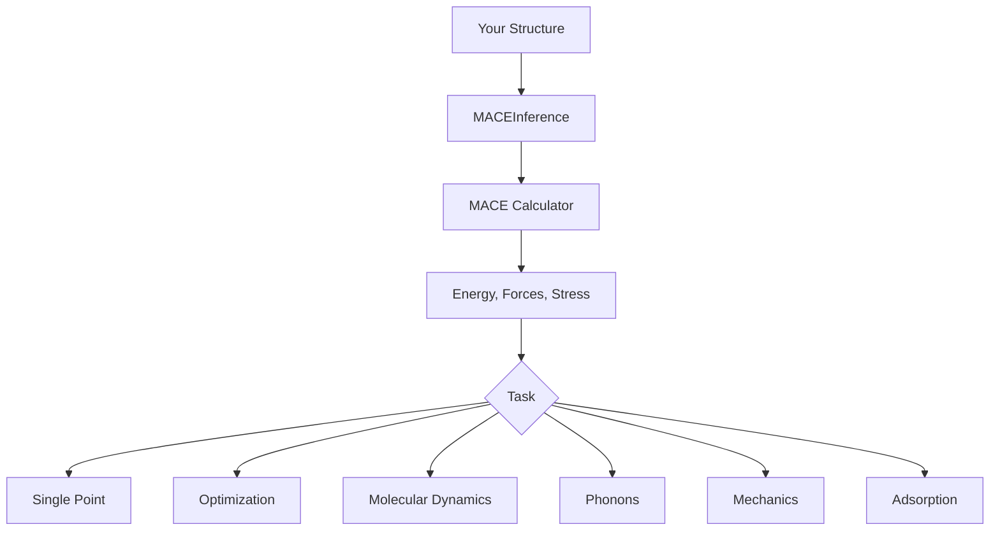

# User Guide Overview

This guide provides detailed information on using MACE Inference for various atomistic simulation tasks.

## Architecture

MACE Inference is built on top of the [MACE](https://github.com/ACEsuit/mace) machine learning potential and the [ASE](https://wiki.fysik.dtu.dk/ase/) (Atomic Simulation Environment) library.



## Core Components

### MACEInference

The main interface class that handles:

- Model loading and caching
- Device management (CPU/GPU)
- Calculator setup with optional D3 correction
- High-level task methods

```python
from mace_inference import MACEInference

calc = MACEInference(
    model="medium",      # Model size or path
    device="auto",       # Device selection
    enable_d3=False,     # D3 dispersion
    default_dtype="float64"  # Precision
)
```

### Tasks

Each simulation task is implemented as a method of `MACEInference`:

| Method | Task | Output |
|--------|------|--------|
| `single_point()` | Energy/forces | Dict with energy, forces, stress |
| `optimize()` | Geometry relaxation | Optimized atoms, trajectory |
| `run_md()` | Molecular dynamics | Trajectory, thermodynamic data |
| `phonon()` | Phonon calculation | Frequencies, DOS, thermal props |
| `bulk_modulus()` | Elastic properties | Bulk modulus, EOS fit |
| `adsorption_energy()` | Adsorption | Binding energy, optimized complex |
| `coordination()` | Structure analysis | Coordination numbers |

## Typical Workflow

### 1. Prepare Your Structure

MACE Inference works with ASE `Atoms` objects:

```python
from ase.io import read
from ase.build import bulk, molecule

# From file
atoms = read("structure.cif")

# Built-in structures
cu = bulk("Cu", "fcc", a=3.6)
h2o = molecule("H2O")
```

### 2. Initialize Calculator

```python
calc = MACEInference(model="medium", device="auto")
```

### 3. Run Calculations

```python
# Single calculation
result = calc.single_point(atoms)

# Or chain multiple
opt_result = calc.optimize(atoms)
md_result = calc.run_md(opt_result['atoms'], ensemble="nvt", temperature=300)
```

### 4. Analyze Results

All methods return dictionaries with results:

```python
# Single-point result
{
    'energy': -123.45,           # Total energy (eV)
    'energy_per_atom': -4.12,    # Energy per atom (eV)
    'forces': array(...),        # Forces (N, 3) (eV/Å)
    'max_force': 0.05,           # Maximum force magnitude
    'stress': array(...)         # Stress tensor (Voigt, eV/ų)
}
```

## Input/Output

### Supported File Formats

MACE Inference supports all formats that ASE can read:

- **CIF** - Crystallographic Information File
- **POSCAR/VASP** - VASP format
- **XYZ** - Extended XYZ format
- **PDB** - Protein Data Bank
- **And many more...**

### Saving Results

```python
from ase.io import write

# Save optimized structure
result = calc.optimize(atoms)
write("optimized.cif", result['atoms'])

# Save MD trajectory
result = calc.run_md(atoms, ensemble="nvt", temperature=300, steps=1000)
write("trajectory.xyz", result['trajectory'])
```

## Best Practices

### 1. Use Appropriate Model Size

- **`small`**: Quick screening, testing workflows
- **`medium`**: Production calculations, good balance
- **`large`**: High-accuracy calculations, benchmarking

### 2. Optimize Before Dynamics

Always relax your structure before running MD:

```python
# First optimize
opt = calc.optimize(atoms, fmax=0.01)

# Then run MD on relaxed structure
md = calc.run_md(opt['atoms'], ensemble="nvt", temperature=300)
```

### 3. Check Convergence

Verify your calculations converged:

```python
result = calc.optimize(atoms, fmax=0.01, steps=500)
if not result['converged']:
    print("Warning: Optimization did not converge!")
    print(f"Final max force: {result['max_force']:.4f} eV/Å")
```

### 4. Use D3 for Appropriate Systems

Enable D3 correction for:

- Van der Waals crystals
- Metal-organic frameworks (MOFs)
- Layered materials (graphite, MoS₂)
- Molecular crystals
- Adsorption studies

```python
calc = MACEInference(model="medium", enable_d3=True, d3_xc="pbe")
```

## Guides by Task

Each task has a dedicated guide:

- [Single Point Calculations](single-point.md)
- [Structure Optimization](optimization.md)
- [Molecular Dynamics](molecular-dynamics.md)
- [Phonon Calculations](phonons.md)
- [Mechanical Properties](mechanics.md)
- [Adsorption Studies](adsorption.md)
- [D3 Dispersion Correction](d3-correction.md)
